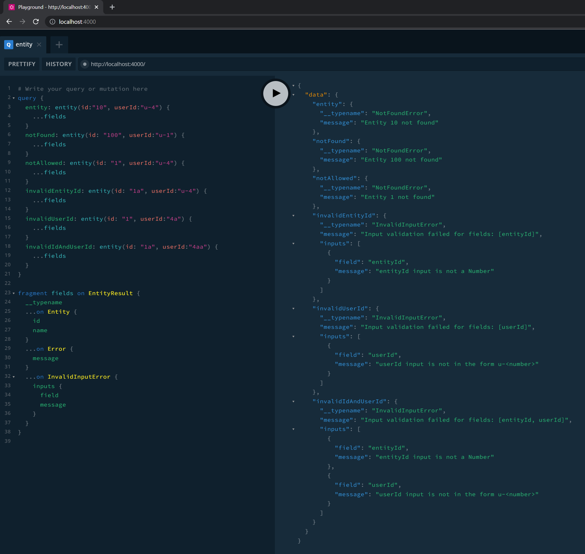

This example project demonstrates how to implement error handling in a GraphQL server using the power of GraphQL Union Types and Functional Programming (using `fp-ts` library).

## Running this example

1. Install all dependencies from the root of the repo (using `yarn`)
2. Run `yarn start`, alternatively to use the debugger run `yarn dev`
3. Go to [the Playground](http://localhost:4000/) or any GraphQL client (Altair, Insomnia, ...) or just cURL:
```
curl -X POST 'http://localhost:4000/' -H 'Content-Type: application/json' --data-raw '{ "query": "query hello { hello }" }'
```

## Example
